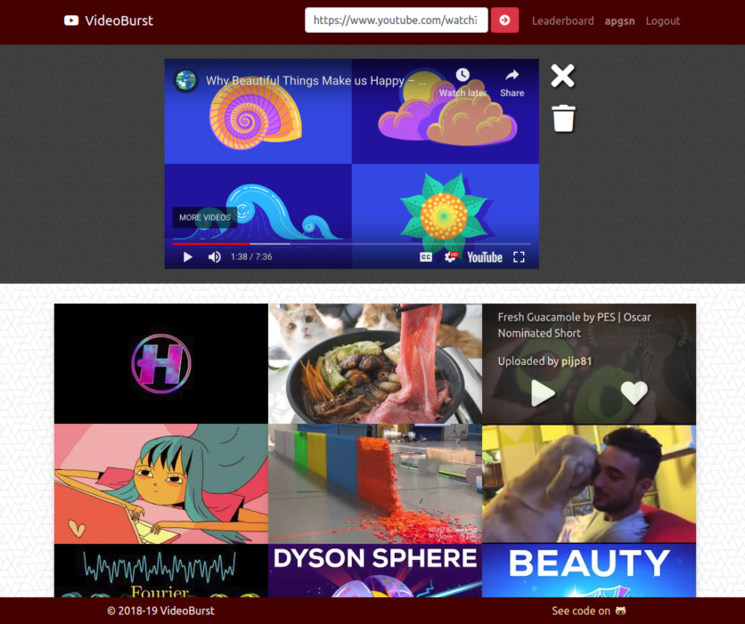

# VideoBurst

### Pop the YouTube bubble

A full-stack MERN application. Share your favorite Youtube videos in freedom, play those shared by others, give and collect likes, and climb the leaderboard by sharing the best content.

Try [VideoBurst](https://videoburst.herokuapp.com/) (Alpha)

#### Features

The main page shows a collection of videos shared by all the users of the site. Hovering on a thumbnail reveals some details and actions that can be performed, such as playing the video, liking/unliking it (for authenticated users only), or checking the uploader's profile. By clicking on play, a section with an embedded Youtube player opens up, and can be left open even when navigating to other pages.  
Each user has the option to register and log in to the site, following which they can upload videos, like/unlike other users' videos, remove their own uploads (thus losing all of the likes they received from other users), modify their profile description by adding a bio and social media links, or delete their account altogether.  
There's also a leaderboard section showing who the most liked users are.  
All of this is served by a REST/JSON API with public and private routes taking care of the validation of the user's input, the Youtube API calls, the user's authentication, and the internal logic of the app. When errors arise they get sent back to the client and presented to the user through a mechanism of error pop-ups and input-highlighting.

#### Tools

**Frontend**: React, Redux, CSS3, Bootstrap, Font Awesome, Jdenticon.  
**Backend**: Node, Express, MongoDB/Mongoose, JWT Authentication, Youtube API.

#### Notes on implementation

Make sure you have Node.js and npm installed. Clone this repo and install the dependencies listed in the `Package.json` files located in the main folder and in the `client` one. In `config`, add a file named `keys_dev.js` and store your personal keys here (see `keys_prod.js` for the production counterpart). Finally, use the command `npm run dev` in main to lauch the app.
